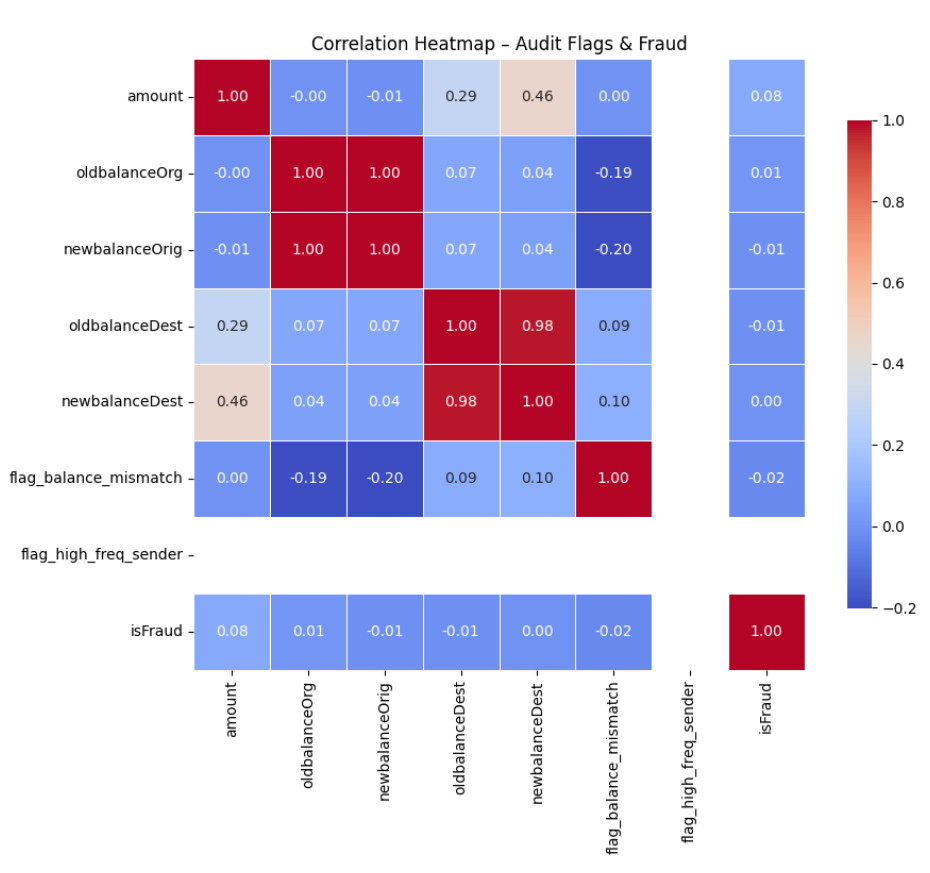
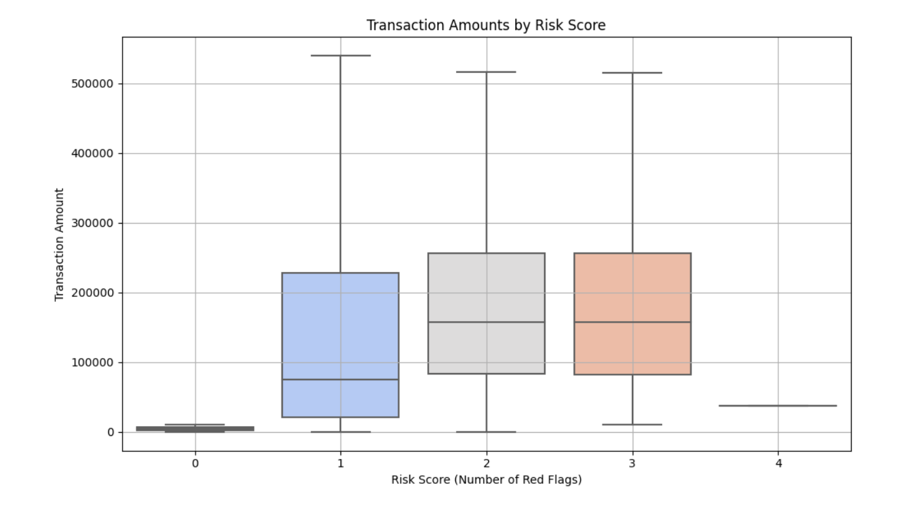
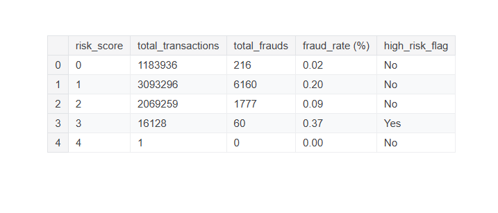

# 🧾 Audit-Based Fraud Flagging in PaySim Data (Python)

## 🔍 Project Summary

This project simulates a **real-world digital audit review** using the **PaySim synthetic financial transactions dataset**. It replicates procedures a modern audit team might perform to detect potential fraud or red flags in large-scale financial data—without using machine learning.

It applies **Python-based logic and controls testing** to identify **high-risk transactions**, **flag inconsistencies**, and **assign risk scores** using classic audit red flag techniques. 

✅ **Goal:** Help auditors prioritize cases, understand fraud patterns, and generate evidence-ready audit observations.

---

## 💼 International Auditing Standards (IAS) Demonstrated

This audit analytics approach aligns with:

- **ISA 240 – The Auditor’s Responsibilities Relating to Fraud**
- **ISA 315 – Identifying and Assessing Risks of Material Misstatement**
- **ISA 330 – Auditor Responses to Assessed Risks**

---

## 🛠 Tools & Technologies

| Tool              | Role                                                                 |
|-------------------|----------------------------------------------------------------------|
| Python (pandas)   | Data cleansing, red-flag logic, risk scoring                         |
| Jupyter Notebook  | Code walkthrough + visuals                                           |
| Seaborn, Matplotlib| Visual analysis of fraud patterns                                   |
| GitHub            | Documentation and version control                                    |

---

## 📊 Dataset Overview

- **Source**: [PaySim Dataset on Kaggle](https://www.kaggle.com/datasets/ntnu-testimon/paysim1)
- **Size**: 6+ million mobile money transactions
- **Fields**: Type, amount, sender/receiver balances, fraud indicators

---

## 🔍 Red Flag Audit Tests Applied

| Audit Test Name                         | Description                                                                 |
|----------------------------------------|-----------------------------------------------------------------------------|
| **balance_mismatch**                   | Flags mismatch between expected and actual account balances post-transaction|                   
| **High-Value Transactions**            | Flags payments over $200,000                                               |
| **Fraud Indicators (isFraud)**         | Pre-labeled fraudulent transactions                                        |
| **Flagged Fraud (isFlaggedFraud)**     | System-flagged transactions                                                |
| **Balance Discrepancy Detection**      | Detects abnormal balance movements post-transaction                        |
| **Multi-Destination Transfers**        | Sender sends to >3 recipients in a short window                            |
| **Cash Out Alerting**                  | Flags large ‘CASH_OUT’ amounts                                             |
| **Risk Score Assignment**              | Custom audit score based on red flag combination                          |

---

## 📷Screenshots of Python Outputs
- screenshot of correlation Heatmap of audit flags and fraud:
- 
- screenshot of Transaction amounts by Risk score:
- 
- screenshot of Risk Fraud Summary:
- 

## 📈 Key Findings & Insights

🛑 **Fraud volume is low, but value is very high.**  
Fraudulent transactions make up less than 0.1% of the dataset—but often involve very high amounts.

🔁 **Transfer patterns reveal smurfing behavior.**  
Users sending small amounts to many recipients may be laundering or obfuscating funds.

📉 **Balance mismatch flags control issues.**  
Inconsistencies in post-transaction balances signal poor transaction controls.

⏱ **Fraud spikes at consistent times (step values).**  
Fraud patterns follow time-based clusters, allowing risk prediction.

🎯 **Scoring helps focus auditor review.**  
A risk scoring system helps auditors focus on the top 0.5% of high-risk transactions instead of full population.

---
## 🎯 Audit Use Case
This project simulates a digitally enabled audit approach where the auditor:

-Applies custom fraud red flags to transactional data
-Aggregates them into a risk score per transaction
-Focuses testing effort on high-risk buckets (score ≥ 3)
-Visualizes audit risk trends using boxplots and heatmaps

## 🧰 Skills Demonstrated
-Red flag engineering using Python (Pandas, NumPy)
-Audit logic design in line with ISA 240 (fraud risk)
-Data visualization with Seaborn and Matplotlib
-Exploratory Data Analysis (EDA) and risk scoring
-Practical application of audit analytics in a real-world context

## 📎 Audit-Relevant Takeaways
Demonstrates end-to-end red flag testing logic

Uses full population instead of sampling

Mimics automated risk scoring workflows used in digital audit teams

Easy to adapt to ERP/ledger data (SAP, Oracle, etc.)

##  🏁 Conclusion
This audit simulation project blends data analytics with audit logic to detect fraud risk and control weaknesses. It showcases the potential for data-driven auditing that Big 4 firms are actively investing in. Designed to impress audit recruiters and demonstrate audit data maturity.

## 👤 Author
Ashik Thomas,

ACCA Part Qualified

